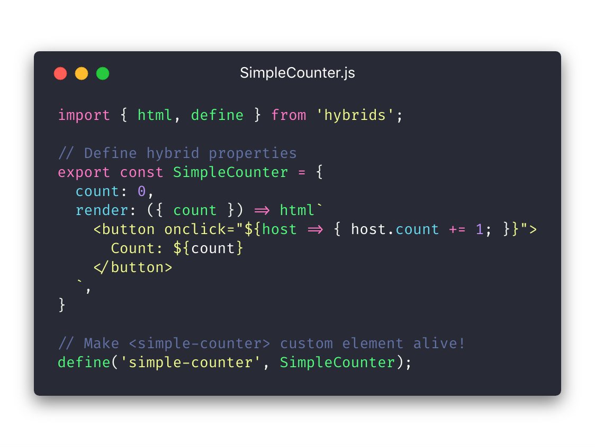

<h1 align="center">
  
  <br/>
  hybrids
</h1>

<p align="center">
  <a href="https://www.npmjs.com/package/hybrids"></a>
  <a href="https://www.npmjs.com/package/hybrids"></a>
  <a href="https://travis-ci.org/hybridsjs/hybrids"></a>
  <a href="https://coveralls.io/github/hybridsjs/hybrids?branch=master"></a>
  <a href="https://conventionalcommits.org"></a>
  <a href="LICENSE"></a>
</p>

<p align="center">
  UI library for creating <a href="https://www.webcomponents.org/">Web Components</a> with simple and functional API
</p>

<p align="center">
  <a href="https://stackblitz.com/edit/hybrids-simple-counter?file=simple-counter.js" alt="Edit Simple Counter">
    </a>
</p>

<h5 align="center">
  <a href="https://stackblitz.com/edit/hybrids-simple-counter?file=simple-counter.js" alt="Edit Simple Counter">
    Playground powered by ⚡StackBlitz
  </a>
</h5>

## Key Features <!-- omit in toc -->

* **The Simplest Definition**. Rather than using `class` and `this` syntax, the library uses plain objects with property descriptors and pure functions for defining custom elements.
* **Composition over the Inheritance**. Hybrid property descriptors can be re-used, merged or split between the definitions and many more (for example using object rest/spread properties).
* **No Global Lifecycle Callbacks**. The library says no to `will` and `did` - properties are independent and only have `connect` callback in the definition (with support for returned `disconnect` callback).
* **Memoized Property Value**. Property value is cached by default and recalculated only when related properties changes, which makes the library super fast!
* **Template as You Always Wanted**. Without external tools, with built-in result caching and using tagged template literals, `hybrids` gives you all power to create views with JavaScript included.
* **Integration with Developer Tools**. The library supports **Hot Module Replacement** - custom elements are live updated without the need to refresh the page.

## Contents <!-- omit in toc -->
- [Installation](#installation)
- [Browser Support](#browser-support)
- [Custom Element Definition](#custom-element-definition)
- [Hybrid Property Descriptor](#hybrid-property-descriptor)
  - [Property Translation](#property-translation)
- [Factories](#factories)
  - [Property](#property)
    - [Transform Matching Types](#transform-matching-types)
    - [Attribute Fallback](#attribute-fallback)
  - [Parent & Children](#parent--children)
  - [Render](#render)
- [Templates](#templates)
  - [Properties & Attributes](#properties--attributes)
    - [Class](#class)
    - [Style](#style)
    - [Mixed Values](#mixed-values)
  - [Event Listeners](#event-listeners)
  - [Values](#values)
    - [Conditions](#conditions)
    - [Nested Templates](#nested-templates)
    - [Arrays](#arrays)
    - [Promises](#promises)
  - [Resolving Dependencies](#resolving-dependencies)
  - [Limitations](#limitations)
- [Utils](#utils)
- [License](#license)

## Installation

The recommended way is to use the `npm` registry:
```bash
npm install hybrids
# or
yarn add hybrids
```

You can also use the built version of the library (with `hybrids` global namespace): 
```html
<script src="https://unpkg.com/hybrids/dist/hybrids.js"></script>
```

> For the built version all name exports of the `hybrids` are available on the `hybrids` global namespace.

## Browser Support

The library requires `Promise` and `Reflect.construct` APIs and [Shadow DOM](https://w3c.github.io/webcomponents/spec/shadow/), [Custom Elements](https://www.w3.org/TR/custom-elements/), and [Template](https://www.w3.org/TR/html-templates/) specifications. You can use `hybrids` in all evergreen browsers and IE11 including list of required polyfills and shims. The easiest way is to add the following code on top of your project:

```javascript
// Promise and Reflect.construct polyfills loaded if IE11 is detected
// Web Components shims and polyfills (external packages)
import 'hybrids/shim'; 
...
```

Web components shims have some limitations. Especially, [`webcomponents/shadycss`](https://github.com/webcomponents/shadycss) approximates CSS scoping and CSS custom properties inheritance. Read more on the [known issues](https://github.com/webcomponents/webcomponentsjs#known-issues) and [custom properties shim limitations](https://www.polymer-project.org/3.0/docs/devguide/custom-css-properties#custom-properties-shim-limitations) pages.

> The library calls shims if they are needed, so direct use is not required.

## Custom Element Definition

```javascript
import { define } from 'hybrids';

const MyElement = { ... };
define('my-element', MyElement);
```

`define` takes tag name and plain object with a map of hybrid property descriptors, creates `Wrapper` constructor, applies properties on the `Wrapper.prototype` and defines custom element using `customElements.define()` method.

#### `define(tagName: string, descriptors: Object): Wrapper` <!-- omit in toc -->

* **arguments**:
  * `tagName` - custom element tag name,
  * `descriptors` - object with a map of hybrid property descriptors
* **returns**: 
  * `Wrapper` - custom element constructor (extends `HTMLElement`)

## Hybrid Property Descriptor

The following code shows a complete structure of the hybrid property descriptor: 
```javascript
const MyElement = {
  propertyName: {
    get: (host, lastValue) => { ... },
    set: (host, value, lastValue) => { ... },
    connect: (host, key, invalidate) => {
      ...
      return () => { ... }; // disconnect
    },
  },
};
```

> `get` or `set` method is required, `connect` method can be omitted

For the callbacks definition, pure functions without side effects are in favor over `this` syntax. Moreover, where it applies the first argument is a `host` - custom element instance. This gives full access to the defined hybrid properties and DOM element API as well as an ability to use argument destructuring.

#### `get: (host: Element, lastValue: any) => { ... }` <!-- omit in toc -->

* **arguments**:
  * `host` - element instance
  * `lastValue` - last cached value of the property
* **returns (required)**:
  * `value` - value of the current state of the property

Value of the hybrid property is cached by default. `get` method is called only if other hybrid properties used in the body of the getter function have changed. For example, in the following code, `name` property getter is only called if `firstName` or `lastName` has changed:

```javascript
const MyElement = {
  firstName: 'John',
  lastName: 'Smith',
  name: ({ firstName, lastName }) => `${firstName} ${lastName}`,
};
```
> The example uses [property translation](#) feature, `name` property is translated to `get` method of property descriptor

#### `set: (host: Element, value: any, lastValue: any) => {...}` <!-- omit in toc -->

* **arguments**:
  * `host` - an element instance
  * `value` - a value passed to assertion (ex., `el.myProperty = 'new value'`)
  * `lastValue` - a last cached value of the property
* **returns (required)**: 
  * `nextValue` - a value of the property, which replaces cached value

`set` method is called within every assertion of the property. The cached value is invalidated if returned `nextValue` is not equal to `lastValue` (`nextValue !== lastValue`). However, `get` method is called in the next get call of the property (it is not recalculated after invalidation). Nonprimitive values should be treated as immutable - property is invalidated when value reference changes.

#### `connect: (host: Element, key: string, invalidate: Function) => { ... }` <!-- omit in toc -->

* **arguments**:
  * `host` - an element instance
  * `key` - a property key name
  * `invalidate` - a callback function, which invalidates cached value
* **returns (not required):**
  * `disconnect` - a function (without arguments)

`connect` method is called synchronously in the `connectedCallback` of the custom element. Similarly, returned `disconnect` function is called in the `disconnectedCallback`.

`invalidate` callback function forces property value recalculation. It can be used to connect to async web APIs or external libraries.

> Invalidate (explicit or by assertion) triggers `@invalidate` custom event on the element (composed and bubbling). It allows observing elements changes.

### Property Translation

Using explicit hybrid property descriptor structure for defining properties is usually not required because `define` method translates values to built-in factory functions or to property descriptors. Translation is done in the following order:

```javascript
const MyElement =  {
  // If a key is "render"
  render: () => {},
  // it equals to `render` factory function:
  render: render(() => {}),

  // If value is a function
  computedValue: ({ firstName, lastName }) => `${firstName} ${lastName}`, 
  // it equals to object with `get` key:
  computedValue: {
    get: ({ firstName, lastName }) => `${firstName} ${lastName}`,
  },

  // If value is primitive value
  primitive: 'text', // String, Number, Boolean, ...
  // it equals to `property` factory function:
  primitive: property('text'),

  // If value is an object without `get` and `set` properties
  emptyArray: [],
  // it equals to `property` factory function:
  emptyArray: property([]),
};
```

Object descriptor passed to the `define` method is not changed and it stays as it was defined. It means, that custom element definition can be just a simple structure of default values and methods without external dependencies.

## Factories

The factory is a function, which produces hybrid property descriptor. Rather than explicitly describe the property, factories hide implementation details and minimize redundant code. `hybrids` includes four factories, which cover the most important features for creating custom elements.

### Property

#### `property(defaultValue: any, [connect: Function]): Object` <!-- omit in toc -->

* **arguments**:
  * `defaultValue` - any value
  * `connect` - a connect callback function of the property descriptor
* **returns**:
  * hybrid property descriptor, which resolves to value

`property` creates property binding with fallback to corresponding element's attribute. `property` uses a transform function, which ensures the strict type of the value set by an attribute or a property.

Type of the passed `defaultValue` is used to detect transform function. For example, when `defaultValue` is set to `"text"`, `String` function is used. `defaultValue` can be a transform function itself, which is called when a property value is set.

#### Transform Matching Types

* `string` -> `String(value)`
* `number` -> `Number(value)`
* `boolean` -> `Boolean(value)`
* `function` -> `defaultValue(value)`
* `object` -> `Object.freeze(value)`
* `undefined` -> `value`

Object values are frozen to prevent mutation of the own properties, which does not invalidate cached value. Moreover, `defaultValue` is shared between custom element instances, so it should not be changed by any of them.

To omit transform, `defaultValue` has to be set to `undefined`.

#### Attribute Fallback

All types except `object` and `undefined` create a fallback connection to element attribute (dashed name of the property key). An attribute value is used only once when element is connected. The library follows HTML specification and properly transforms attribute to `boolean` and `string` values.

### Parent & Children

Rather than using custom element tag name, access to parent or children elements is set by the reference to an object containing hybrid property descriptors. This feature allows avoiding name collision between custom elements because it is irrelevant on what name related custom element is defined.

> Binding can be created only between custom elements defined by the library. Built-in elements or other custom elements are not supported.

#### `parent(hybrids: Object): Object`  <!-- omit in toc -->

* **arguments**:
  * `hybrids` - reference to an object containing hybrid property descriptors
* **returns**: 
  * hybrid property descriptor, which resolves to `null` or `Element` instance 

`parent` creates a binding with custom element (defined with `hybrids`) in upper DOM tree up to `document.body` level (crossing Shadow DOM boundary). The binding is set and updated when custom element is connected and disconnected.

Resolved parent custom element can be safely used in other hybrid properties. If parent hybrid property invalidates, the value of a related property is invalidated as well.

In the following example, `label` relates to `count` property of the `AppStore`. The value of `label` is invalidated and recalculated when `count` changes:

```javascript
import { parent } from 'hybrids';

const AppStore = {
  count: 0,
};

const MyElement = {
  store: parent(AppStore),
  label: ({ store: { count } }) => `store count: ${count}`,
}
```

Possible usage in html (tag names can be different):

```html
<app-store count="42">
  <my-element></my-element>
</app-store>
```

#### `children(hybrids: Object, [options: Object]): Object`  <!-- omit in toc -->

* **arguments**:
  * `hybrids` - reference to an object containing hybrid property descriptors
  * `options` - object with available keys:
    * `deep` - boolean, defaults to `false`
    * `nested` - boolean, defaults to `false`
* **returns**:
  * hybrid property descriptor, which resolves to `array` of `Element` instances

`children` creates a binding with children elements (only in light DOM). Without options, only direct children of the element are on the list. `deep` option allows traversing
deeper children. `nested` option allows adding element and children of that element if the condition is met (`nested` option works only with turn on `deep` option).

In the same way as `parent` factory works, `children` binding invalidates properties when a hybrid property of one of the resolved custom elements is used. 

```javascript
import { children } from 'hybrids';

const TabItem = {
  name: '',
  active: false,
  ...
};

const TabGroup = {
  tabs: children(TabItem),
  active: ({ tabs }) => tabs.find((tab) => tab.active),
  ...
};
```

Possible usage in html (tag names can be different):

```html
<tab-group>
  <tab-item name="one"></tab-item>
  <tab-item name="two" active></tab-item>
</tab-group>
```

### Render

#### `render(fn: Function): Object`  <!-- omit in toc -->

* **arguments**:
  * `fn(host: Element): Function` - callback function with `host` argument; returned function have `host` and `shadowRoot` arguments
* **returns**:
  * hybrid property descriptor, which resolves to function

`render` creates views in the custom element Shadow DOM. It is template agnostic - passed `fn` should return function for updating DOM. The preferred way is to use template engine from the library, but it can be used with any external UI library, that renders DOM.

```javascript
import { render } from 'hybrids';

const MyElement = {
  customRender: render((host) => {
    return (host, shadowRoot) => {
      // Update DOM here
    };
  }),
};
```

Updates are scheduled with `requestAnimationFrame()` API triggered by `@invalidate` event listener on document level. For example, the view is updated when one of the hybrid property used in `fn` changes. If execution of the update function passes ~16ms threshold (it counts from the beginning of the schedule), next element in the queue is updated with next `requestAnimationFrame()`.

`render` factory ensures update after invalidation of hybrid property, but it is possible to trigger update by calling property manually on the element instance.

Property defined with `render` factory uses the same cache mechanism like other hybrid properties. It means that `fn` is only called if hybrid properties invalidate.

## Templates

The main concept is inspired by the [`lit-html`](https://github.com/Polymer/lit-html), but the implementation is different and follows own conventions. The library provides `html` and `svg` functions for creating templates (both have the same interface, but `svg` uses SVG namespace). They use tagged template literals syntax to create  DOM and update dynamic parts leaving static content untouched.

> For the best development experience, check if your code editor supports highlighting HTML in tagged template literals

### Properties & Attributes

```javascript
html`<div propertyName="${value}"></div>`;
```

Attribute expression set a case-sensitive property of element instance (if it has that property in `prototype`) with fallback to attribute. There are two exceptions, where it works differently.

#### Class

`class` attribute expression adds or removes a class from element's `classList`. An expression can be a string, an array of strings or a map of keys with boolean values.

```javascript
const name = 'one two';
const array = ['one', 'two'];
const map = { one: true, two: false };

html`<div class="${name || array || map}"></div>`;
```

#### Style

`style` attribute expression set style properties by the `CSSStyleDeclaration` API. An expression has to be an object with dashed or camel-case keys with values.

```javascript
const styles = {
  backgroundColor: 'red',
  'font-face': 'Arial',
};

html`<div style="${styles}"></div>`;
```

#### Mixed Values

Attribute expression with other text resolves to `string` attribute value:

```javascript
html`<div class="button ${buttonType} ${buttonColor}"></div>`
```

### Event Listeners

`on*` attribute expression resolves to event listener set by the `addEventListener` API. The part of the attribute after `on` prefix is used as an event type. The function returned by the expression is called in an event listener callback.

```javascript
function send(host, event) {
  // do something with value
}

const MyElement = {
  value: 42,
  render: () => html`
    <button onclick="${send}">Send</button>
  `,
};
```

`host` references to custom element instance (target element is available at `event.target`). The scope of the render function is not required, so a callback can be defined as a pure function.

### Values

`string`, `number` and `object` value resolves to `textContent` (HTML can be set by the `innerHTML` property).

```javascript
html`<div>Name: ${name}, Count: ${count}</div>`;

// Use it with caution, it might open XSS attack
html`<div innerHTML="${htmlCode}"></div>`;
```

#### Conditions

Falsy expression removes previous truthy value from DOM and render nothing (the exception is number `0`).

```javascript
html`<div>${isValid && ...}</div>`;
```

#### Nested Templates

An expression can return a function, which takes two arguments: `host` and `target` (text node position marker). Update function returned by the `html` is compatible with this API and it can create nested templates.

```javascript
const submit = (fn) => html`
  <button onclick=${fn}>Submit</button>
`;

function myCallback(host, event) {...}

html`
  <form>
    ...
    ${submit(myCallback)}
  </form>
`;
```

In above example `submit` factory function returns an update function created by the `html`. The context is propagated, so `fn` callback will get the same `host` argument as the main template.

#### Arrays

For iteration, expression should return an `array` with a list of content expressions. Items can be primitive values, nested templates as well as nested arrays.

```javascript
html`
  <todo-list>
    ${names.map((name) => `Name: ${name}`)}

    ${items.map(({ id, name }) => 
      html`<todo-item>${name}</todo-item>`.key(id)
    )}
  </todo-list>
`;
```

Array `index` identifies rendered expressions. For efficient re-order use `html` function and set iteration key by `key` method on returned update function (it sets key and returns update function).

```javascript
html`...`.key(id)
```

#### Promises

Expression does not support promises, but the library support them by the `html.resolve` method.

#### `html.resolve(promise, placeholder, delay = 200)` <!-- omit in toc -->

* **arguments**:
  * `promise` - promise, which should resolve/reject update function
  * `placeholder` - update function for render content until promise is resolved or rejected
  * `delay` - delay in milliseconds, after which placeholder is rendered 
* **returns**:
  * update function compatible with content expression 

```javascript
const promise = asyncApi().then(...);

html`
  <div>
    ${html.resolve(
      promise
        .then((value) => html`<div>${value}</div>`)
        .catch(() => html`<div>Error!</div>`),
      html`Loading...`,
    )}
  </div>
`
```

### Resolving Dependencies

For templates, which use other custom elements, update function provides helper method for resolving dependencies dynamically. It takes an object with key/value pairs of hybrids definitions or custom element's constructors and defines them.

This method helps to avoid defining unused elements and allows creating a tree-like dependency structure. A complex structure may require only one explicit definition at the root level. As the library factories decouple tag name from the definition, elements can be set with custom names.

> In the future, when scoped [custom element registers](https://github.com/w3c/webcomponents/issues/716) will be available, `define` helper will benefit from that feature and register elements in the `host` element scope.

#### `` html`...`.define(map: Object) `` <!-- omit in toc -->

* **arguments**:
  * `map` - object with pascal case or camel case keys and hybrids definitions or custom element's constructors as values
* **returns**:
  * update function compatible with content expression 

```javascript
import UiHeader from './UiHeader';

const UiCard = {
  ...,
  render: ({ withHeader }) => html`
    <div>
      ${withHeader && html`
        <ui-header>...</ui-header>
      `.define({ UiHeader })}
      ...
    </div>
  `,
};
```

In above example, the customer of the `UiCard` element does not have to explicitly define `UiHeader`. It will be defined and processed inside of the rendering process (and only if `withHeader` is rendered).

### Limitations

`<template>` element with expressions is not supported:
  ```javascript
  // breaks template
  html`
    <custom-element>
      <template>
        <div class="${myClass}"></div>
      </template>
      <div>${content}</div>
    </custom-element>
  `;
  ```
  ```javascript
  // works fine
  html`
    <custom-element>
      <template>
        <div class="my-static-class"></div>
      </template>
      <div>${content}</div>
    </custom-element>
  `;
  ```
`<table>`, `<tr>`, `<thead>`, `<tbody>`, `<tfoot>` and `<colgroup>` elements with expressions should not have additional text other than whitespace:
  ```javascript
  // breaks template
  html`<tr>${cellOne} ${cellTwo} some text</tr>`;
  ```
  ```javascript
  // works fine
  html`<tr>${cellOne} ${cellTwo}</tr>`;
  ```

## Utils

#### `dispatch(host: Element, eventType: string, options)` <!-- omit in toc -->

* **arguments**:
  * `host` - element instance
  * `eventType` - type of the event to be dispatched
  * `options` - object following `dispatchEvent` DOM API specification
* **returns**:
  * `false` if event is cancelable and at least one of the event handlers which handled this event called `preventDefault()`, otherwise it returns `true`

`dispatch` is a helper function, which simplifies event dispatch on element instance. It creates `CustomEvent` with set `options` and dispatches it on given `host` element.

```javascript
import { html, dispatch } from 'hybrids';

function change(host) {
  host.value += 1;
  // Trigger not bubbling `change` custom event
  dispatch(host, 'change');
}

const MyElement = {
  value: 0,
  render: ({ value }) => html`
    <button onclick="${change}">You clicked me ${value} times!</button>
  `,
};
```

## License

`hybrids` is released under the [MIT License](LICENSE.md).
